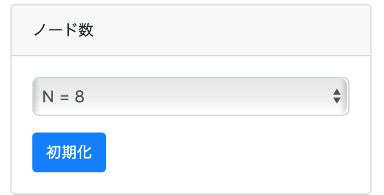
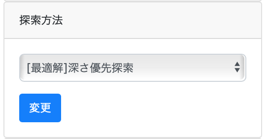
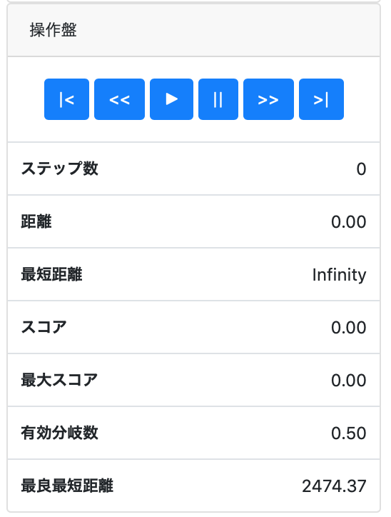
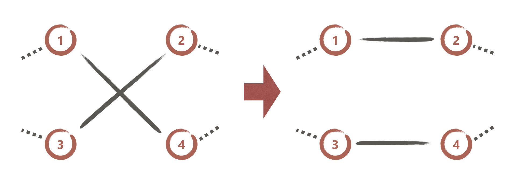

# TSP-Visualizer マニュアル

## 操作方法

### 1. ノード数を選択
画面右のノード数選択フォームから、
探索を行うノード数を選んで、「初期化」ボタンを押してください。
ボタンを押すとランダムに頂点が画面上に配置されます。
ノード数や、配置を変更したい場合も同様にボタンを押すと切り替わります。

### 2. 探索アルゴリズムの選択
画面右の探索方法選択フォームから、探索方法を選択してください。
リストから選択後、「変更」ボタンを押すと探索方法が切り替わります。
この操作では、ノードの配置は変化しないため、同じ配置で、アルゴリズムを比較することができます。

### 3. 探索アルゴリズムの実行

画面右の操作盤のボタンをクリックすることで、アルゴリズムを実行出来ます。
各ボタンの動作は以下の通りです。

- `|<` : 探索開始前に戻ります(乱数の影響を受ける探索では結果が変化します)
- `<<` : 1step前に戻ります(最大で100step)
- `▶` : 1stepずつ表示しながら探索を実行します
- `||` : `▶`による実行を停止します
- `>>` : 1step次に進みます
- `>|` : 探索の最終状態に移動します(計算量が多いアルゴリズムでは、ブラウザが固まる場合があるので注意してください)

## アルゴリズムの説明

### [最適解]深さ優先探索
深さ優先探索を行い、最適解が求まります。
時間計算量は$O(N!)$、空間計算量は$O(N)$です。
探索順は、ノード配置時にランダムに決められた順です。

### [最適解]幅優先探索
幅優先探索を行い、最適解が求まります。
時間計算量は$O(N!)$、空間計算量は$O(N!)$です。
探索順は、ノード配置時にランダムに決められた順です。

### [最適解]A\*探索①
A\*探索を行い、最適解が求まります。
時間計算量は最悪$O(N! \log N)$、空間計算量は最悪$O(N!)$です。
探索順は、ノード配置時にランダムに決められた順です。

ヒューリスティック関数$h_1$の定義は以下の通りです。

$h_1(V) = \max( \max \bar V_{i,x} - \min \bar V_{i,x}, \max \bar V_{i,y} - \min \bar V_{i,y})$

$\bar V :=$ 使用していない頂点の集合

### [最適解]A\*探索②
A\*探索を行い、最適解が求まります。
時間計算量は最悪$O(N! \log N)$、空間計算量は最悪$O(N!)$です。
探索順は、ノード配置時にランダムに決められた順です。

ヒューリスティック関数$h_2$の定義は以下の通りです。

$h_2(s, t, V) = \max( dist(\bar V_i, \bar V_j) ) + \min ( dist(\bar V_i, s) ) + \min (dist(\bar V_i, t))$

$s :=$ 探索開始ノード
$t :=$ 現在の終端ノード
$\bar V :=$ 使用していない頂点の集合
$dist(a, b) :=$ ノードa, b間のユークリッド距離

$h_1(V) \le \max( dist(\bar V_i, \bar V_j) ) \le h_2(s,t,V)$
となるので、②のほうが効率的である。

### [近似解]山登り法
山登り法を行い、近似解が求まります。
TSPを解く山登り法でよく用いられる2-optを使用しています。
更新回数を$T$回とすると、時間計算量は、$O(T N^2)$ 空間計算量は、$O(N)$です。

#### 2-opt
2-optは、全ての2辺の組み合わせに対して「2辺を入れ替える操作」を行い、
一番最適な操作を採用することを繰り返すアルゴリズムです。
以下のように、交差している辺を入れ替えると、距離の和が短くなることが分かります。

### [近似解]焼きなまし法
焼きなまし法を行い、近似解が求まります。
2-optと同様に2辺を入れ替える操作を行いますが、
2辺の選択はランダムに行います。

#### 温度
$T(t) = \alpha ^ {t}, \ \ t = \frac{step}{N^2}$

$\alpha := 0.9$
$N :=$ ノード数

#### 更新条件
以下の2条件の内1つを満たしたら更新します。

1. $dist(current) > dist(new)$
2. $rand(0, 1) < \exp(\frac{dist(current) - dist(new)}{T(t)})$

$dist(current) :=$ 現在の巡回路の距離の総和
$dist(new) :=$ 2辺交換時の巡回路の距離の総和
$rand(a, b) :=$ a以上b未満の一様乱数

